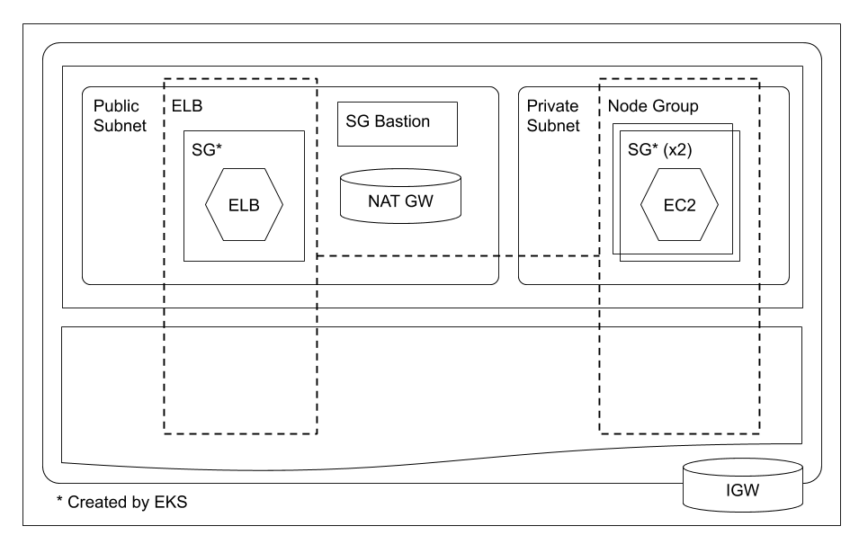

# Elastic Kubernetes Service (EKS)

> Amazon Elastic Kubernetes Service (Amazon EKS) is a fully managed Kubernetes service. Customers such as Intel, Snap, Intuit, GoDaddy, and Autodesk trust EKS to run their most sensitive and mission critical applications because of its security, reliability, and scalability.

[Amazon Elastic Kubernetes Service](https://aws.amazon.com/eks/)

## Network Diagram



## Resources

**VPC**

CIDR Block: 10.0.0.0/16

**Subnet (S0 - Public)**

Availability Zone: us-east-1a
CIDR Block: 10.0.0.0/24

**Subnet (S1 - Public)**

Availability Zone: us-east-1b
CIDR Block: 10.0.1.0/24

**Subnet (S2 - Public)**

Availability Zone: us-east-1c
CIDR Block: 10.0.2.0/24

**Subnet (S10 - Private)**

Availability Zone: us-east-1a
CIDR Block: 10.0.10.0/24

**Subnet (S11 - Private)**

Availability Zone: us-east-1b
CIDR Block: 10.0.11.0/24

**Subnet (S12 - Private)**

Availability Zone: us-east-1c
CIDR Block: 10.0.12.0/24

**Internet Gateway**

**NAT Gateway (S0)**

Subnet: S0

**NAT Gateway (S1)**

Subnet: S1

**NAT Gateway (S2)**

Subnet: S2

**Route Table (Public: S0, S1, S2)**

| Destination | Target |
| ----------- | ------ |
| 10.0.0.0/16 | local  |
| 0.0.0.0/0   | IG     |

**Route Table (S10)**

| Destination | Target |
| ----------- | ------ |
| 10.0.0.0/16 | local  |
| 0.0.0.0/0   | NG S0  |

**Route Table (S11)**

| Destination | Target |
| ----------- | ------ |
| 10.0.0.0/16 | local  |
| 0.0.0.0/0   | NG S1  |

**Route Table (S12)**

| Destination | Target |
| ----------- | ------ |
| 10.0.0.0/16 | local  |
| 0.0.0.0/0   | NG S2  |

**NACL (Public Inbound)**

| Rule | Type | Protocol | Port | Source    | A/D   |
| ---- | ---- | -------- | ---- | --------- | ----- |
| 100  | ALL  | ALL      | ALL  | 0.0.0.0/0 | Allow |
| *    | ALL  | ALL      | ALL  | 0.0.0.0/0 | Deny  |

**NACL (Public Outbound)**

| Rule | Type | Protocol | Port | Dest      | A/D   |
| ---- | ---- | -------- | ---- | --------- | ----- |
| 100  | ALL  | ALL      | ALL  | 0.0.0.0/0 | Allow |
| *    | ALL  | ALL      | ALL  | 0.0.0.0/0 | Deny  |

**NACL (Private Inbound)**

| Rule | Type | Protocol | Port       | Source      | A/D   |
| ---- | ---- | -------- | ---------- | ----------- | ----- |
| 100  | HTTP | TCP      | 80         | 10.0.0.0/16 | Allow |
| 300  | CUST | TCP      | 1024-65535 | 0.0.0.0/0   | Allow |
| 400  | CUST | UDP      | 1024-65535 | 0.0.0.0/0   | Allow |
| 500  | HTTP | TCP      | 22         | 10.0.0.0/16 | Allow |
| *    | ALL  | ALL      | ALL        | 0.0.0.0/0   | Deny  |

**NACL (Private Outbound)**

| Rule | Type | Protocol | Port | Dest      | A/D   |
| ---- | ---- | -------- | ---- | --------- | ----- |
| 100  | ALL  | ALL      | ALL  | 0.0.0.0/0 | Allow |
| *    | ALL  | ALL      | ALL  | 0.0.0.0/0 | Deny  |

**Security Group (Bastion) Inbound**

| Type  | Protocol | Port Range | Source       |
| ----- | -------- | ---------- | ------------ |
| ALL   | ALL      | ALL        | SG (Bastion) |
| SSH   | TCP      | 22         | 0.0.0.0/0    |
| HTTPS | TCP      | 443        | 0.0.0.0/0    |

**Security Group (Bastion) Outbound**

| Type  | Protocol | Port Range | Destination |
| ----- | -------- | ---------- | ----------- |
| ALL   | ALL      | ALL        | 0.0.0.0/0   |

**DynamoDB Table**

Name: Todos

**IAM ROLE**

Name: aws-eks-eksServiceRole

**IAM ROLE**

Name: aws-eks-NodeInstanceRole

**Security Group (Cluster) Inbound**

| Type  | Protocol | Port Range | Source       |
| ----- | -------- | ---------- | ------------ |
| ALL   | ALL      | ALL        | SG (Cluster) |

**Security Group (Cluster) Outbound**

| Type  | Protocol | Port Range | Destination |
| ----- | -------- | ---------- | ----------- |
| ALL   | ALL      | ALL        | 0.0.0.0/0   |

**EKS Cluster**

**EKS Node Group**

Size: 2
Subnets: Private: S10, S11, S12

**IAM OpenID Connect Provider**

**IAM Role**

Name: aws-eks-APIRole

## Commands

**Setup Kubernetes CLI**

Remove existing Kubernetes CLI configuration

```
rm -f -r ~/.kube/
```

Create new Kubernetes CLI configuration

```
aws eks --region us-east-1 update-kubeconfig --name aws-eks
```

**Local Development - Hello World**

Install application dependencies; from *app-hello-world* folder:

```
pipenv install
```

Run application; from *app-hello-world* folder:

```
export LOCALHOST=true
export FLASK_APP=main.py
pipenv run flask run
```

**Publish to Elastic Container Repository - Hello World**

First, create ECR repository, e.g., with AWS Console.

Login Docker CLI to ECR:

```
aws ecr get-login-password \
  --region us-east-1 |\
docker login \
  --username AWS \
  --password-stdin \
  143287522423.dkr.ecr.us-east-1.amazonaws.com
```

Build Docker image:

```
docker build -t aws-eks-hello-world -f Dockerfile-hello-world .
```

Tag image for ECR repository:

```
docker tag aws-eks-hello-world:latest 143287522423.dkr.ecr.us-east-1.amazonaws.com/aws-eks-hello-world:latest
```

Push image to ECR repository:

```
docker push 143287522423.dkr.ecr.us-east-1.amazonaws.com/aws-eks-hello-world:latest

```

**Publish to Elastic Container Repository - API**

First, create ECR repository, e.g., with AWS Console.

```
docker build -t aws-eks-api -f Dockerfile-api .
```

Tag image for ECR repository:

```
docker tag aws-eks-api:latest 143287522423.dkr.ecr.us-east-1.amazonaws.com/aws-eks-api:latest
```

Push image to ECR repository:

```
docker push 143287522423.dkr.ecr.us-east-1.amazonaws.com/aws-eks-api:latest
```

**Learning EKS by Example**

Examples provide by [AWS Elastic Kubernetes Service (EKS) By Example](https://codeburst.io/aws-elastic-kubernetes-service-eks-by-example-82016b467295)

The *hello-world.yml* (using ECR) and *api.yml* (using ECR and AWS roles) examples are more complicated examples.
