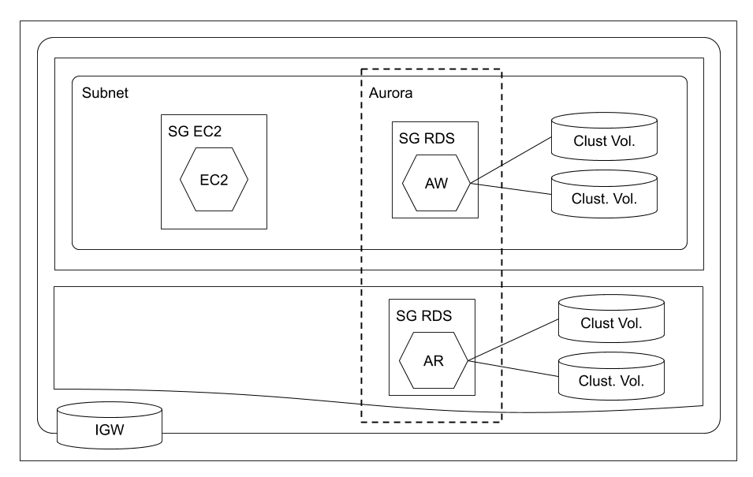

# Amazon Relational Database Service (RDS) Aurora

> Amazon Aurora is a MySQL and PostgreSQL-compatible relational database built for the cloud, that combines the performance and availability of traditional enterprise databases with the simplicity and cost-effectiveness of open source databases.

[Amazon Aurora](https://aws.amazon.com/rds/aurora/)

## Network Diagram

## Variables

- *key_name*: EC2 key pair name (assume exists)
- *vpc_id*: Default VPC id (assume exists)

## Resources

**Security Group (SG EC2) Inbound**

| Type  | Protocol | Port Range | Source    |
| ----- | -------- | ---------- | --------- |
| ALL   | ALL      | ALL        | SG EC2    |
| SSH   | TCP      | 22         | 0.0.0.0/0 |

**Security Group (SG EC2) Outbound**

| Type  | Protocol | Port Range | Destination |
| ----- | -------- | ---------- | ----------- |
| ALL   | ALL      | ALL        | 0.0.0.0/0   |

**Security Group (SG RDS) Inbound**

| Type  | Protocol | Port Range | Source |
| ----- | -------- | ---------- | ------ |
| ALL   | ALL      | ALL        | SG RDS |
| CTM   | TCP      | 5432       | SG EC2 |

**Security Group (SG RDS) Outbound**

| Type  | Protocol | Port Range | Destination |
| ----- | -------- | ---------- | ----------- |
| ALL   | ALL      | ALL        | 0.0.0.0/0   |

**RDS Cluster**

Engine: postgres

**RDS Cluster Instance**

Count: 2

**Elastic Cloud Compute (EC2)**

AMI: Amazon Linux 2 AMI (HVM), SSD Volume Type

## Command

`pgcli -h XXXXX -p 5432 -u postgres`
