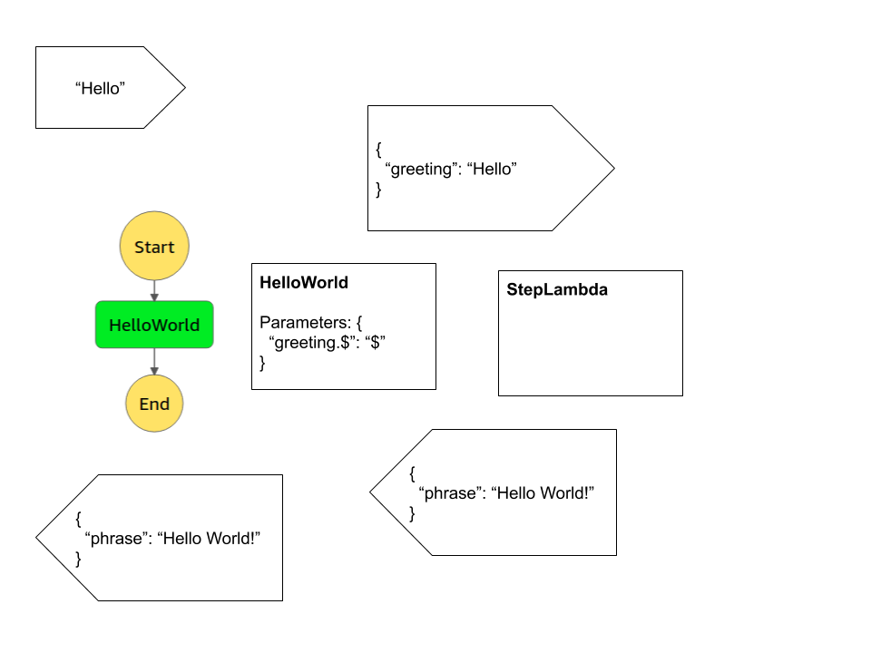

# AWS Step Functions

> AWS Step Functions lets you coordinate multiple AWS services into serverless workflows so you can build and update apps quickly. Using Step Functions, you can design and run workflows that stitch together services, such as AWS Lambda, AWS Fargate, and Amazon SageMaker, into feature-rich applications. Workflows are made up of a series of steps, with the output of one step acting as input into the next. Application development is simpler and more intuitive using Step Functions, because it translates your workflow into a state machine diagram that is easy to understand, easy to explain to others, and easy to change. Step Functions automatically triggers and tracks each step, and retries when there are errors, so your application executes in order and as expected. With Step Functions, you can craft long-running workflows such as machine learning model training, report generation, and IT automation. You can also build high volume, short duration workflows such as IoT data ingestion, and streaming data processing.

[AWS Step Functions](https://aws.amazon.com/step-functions/)

## Logic Diagram

## Resources

**Lambda**

**State Machine**
